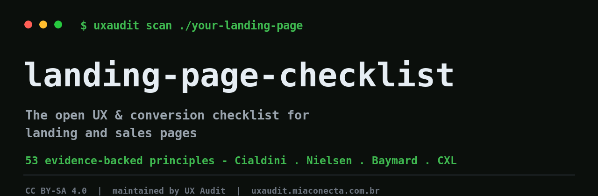

  

  <b>The open, evidence-backed checklist of UX &amp; conversion principles for landing and sales pages.</b>

  53 principles grounded in real research — Cialdini, Nielsen, Baymard, CXL. 
  The open-source companion to <a href="https://uxaudit.miaconecta.com.br">UX Audit</a>.

  <b>English</b> · <a href="README.pt-BR.md">Português 🇧🇷</a>

  <a href="CHECKLIST.md"><b>Checklist</b></a> ·
  <a href="catalog/README.md"><b>Catalog</b></a> ·
  <a href="CONTRIBUTING.md"><b>Contribute</b></a> ·
  <a href="https://uxaudit.miaconecta.com.br"><b>uxaudit.miaconecta.com.br ↗</b></a>

  
  
  
  

---

## What is this

Every landing or sales page trips over the same things: a headline that says nothing, a button you can't find, generic social proof, a form that asks for too much. This is an **open catalog of the 53 principles** that separate a page that converts from one that leaks visitors — each with the *why*, a checklist of what to verify, and the most common mistakes, grounded in real sources (Cialdini, Nielsen Norman Group, Baymard, CXL).

It's free, MIT-of-knowledge, and built to be useful on its own. No fluff, no "growth hacks" — just the principles, the reasoning, and how to check them.

> **You read the principles here; your page gets audited there.**
> The catalog is generic and open. The diagnosis of *your* page — with the evidence on the screen, a score, and a panel of expert lenses — is what [UX Audit](https://uxaudit.miaconecta.com.br) delivers.

## Contents

- [What you get from an audit](#what-you-get-from-an-audit)
- [The 8 categories](#the-8-categories)
- [A sample principle](#a-sample-principle)
- [Who it's for](#who-its-for)
- [How to use it](#how-to-use-it)
- [How the catalog is built](#how-the-catalog-is-built)
- [The Council](#the-council)
- [Contributing](#contributing)
- [License](#license)

## What you get from an audit

  

Real example: the audit of this project's own site (dogfooding).

Each finding is anchored to visible evidence on the page (a screenshot, the DOM, the copy), grouped into **fix first / optional improvements / ready-made copy / what's already good**, with a 0–100 score as a secondary signal. No anchored evidence, no finding.

## The 8 categories

| # | Category | Principles | The focus |
|:--:|---|:--:|---|
| 1 | **Clarity** | 6 | Does the page explain itself in 5 seconds? |
| 2 | **Conversion** | 11 | Is the path to action short and obvious? |
| 3 | **Visual hierarchy** | 8 | Is the eye guided to what matters? |
| 4 | **Trust** | 8 | Is there a reason to believe, with low perceived risk? |
| 5 | **Persuasion** | 7 | Does the copy build relevance and desire? |
| 6 | **Content** | 7 | Does the message speak the customer's language? |
| 7 | **Speed** | 2 | Does the page load before the visitor gives up? |
| 8 | **Accessibility** | 4 | Can everyone use it (WCAG)? |

→ **[Browse the full catalog of 53 principles](catalog/README.md)** · **[Actionable checklist](CHECKLIST.md)**

## A sample principle

Every principle reads like this — short, sourced, and actionable:

> ### Headline that communicates value
> **Clarity · maximum impact**
>
> A headline is the first contract between the page and the visitor. When it promises abstract value ("Transform your business", "Innovative solutions"), the reader's brain doesn't know what to expect — and hesitates. When it's specific ("Cut data analysis time by 70%"), the visitor recognizes relevance immediately.
>
> **How to check your page**
> - [ ] Does the headline state a *specific* benefit (number, timeframe, result), or just vague adjectives like "best", "innovative"?
> - [ ] Could a visitor who's never heard of you understand exactly what they'd gain?
> - [ ] Is the benefit differentiated — not a promise any competitor could make?
>
> *Sources: Nielsen Norman Group (5-second rule), Krug — Don't Make Me Think, CXL.*

→ Read the full version: [`principles/clarity/headline-communicates-value.md`](principles/clarity/headline-communicates-value.md)

## Who it's for

- **Builders & indie hackers (global).** You ship pages fast and want a reliable checklist that fits your workflow — Markdown, GitHub, AI-friendly.
- **Traffic managers & agencies.** You already look for "how to improve a sales page". You want the language of the business — leads, traffic, conversion — and real examples.

## How to use it

1. **Pick a category** that matches your worry (clarity? trust? conversion?).
2. **Run the [checklist](CHECKLIST.md)** against your page — each item links to the full principle with the *why* and common mistakes.
3. **Want it done for you?** Audit your actual page and get the evidence, score, and a second opinion → **[uxaudit.miaconecta.com.br](https://uxaudit.miaconecta.com.br?utm_source=github&utm_medium=isca&utm_campaign=checklist)** (free: 2 audits, no card).

## How the catalog is built

The catalog is **generated** from a single source of truth, so the public copy never silently drifts. Every principle follows the same shape: a one-line definition, why it matters, a checklist, common mistakes, and sources. Curation rules: evidence first (every claim points to a recognized source), no invented statistics, and the customer's language over academic jargon. See [CONTRIBUTING](CONTRIBUTING.md) to propose a principle or send a real-world example.

## The Council

  

Beyond the objective checklist, UX Audit offers a **second opinion**: a council that reviews your page through several expert conversion lenses, arbitrates the trade-offs, and returns a verdict with a hypothesis and a priority. It's the judgment a single automated check can't give on its own.

## Contributing

Missing a principle? Have a real landing page (in any language) that nails — or breaks — one of them? PRs and issues are welcome — see [CONTRIBUTING](CONTRIBUTING.md). Good contributions become part of the catalog and help everyone shipping pages.

## License

Content is licensed under **[CC BY-SA 4.0](LICENSE)** — use, adapt, and share it with attribution; derivatives stay open. Maintained by [UX Audit](https://uxaudit.miaconecta.com.br).

If this helped, a ⭐ goes a long way.

