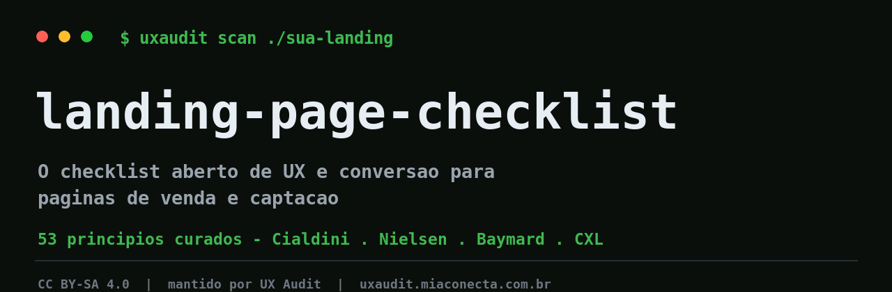
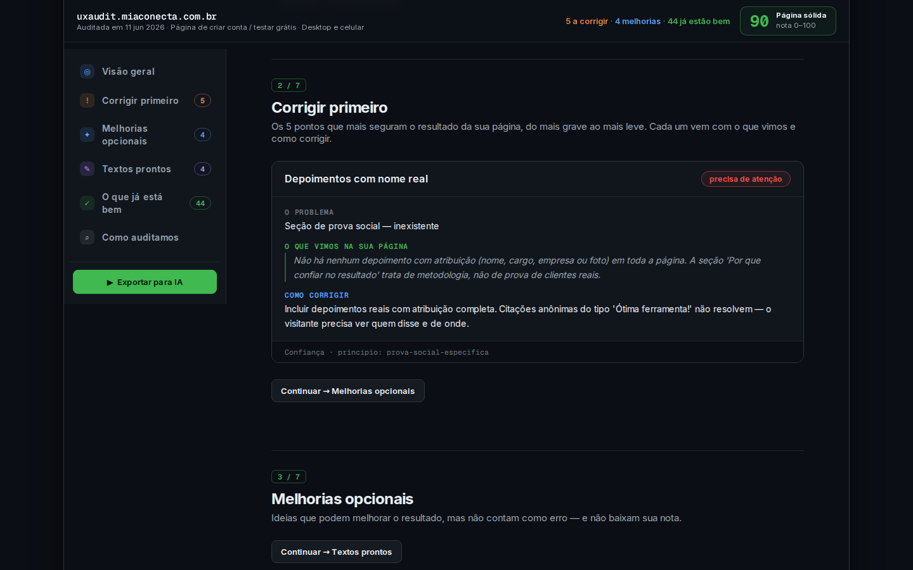
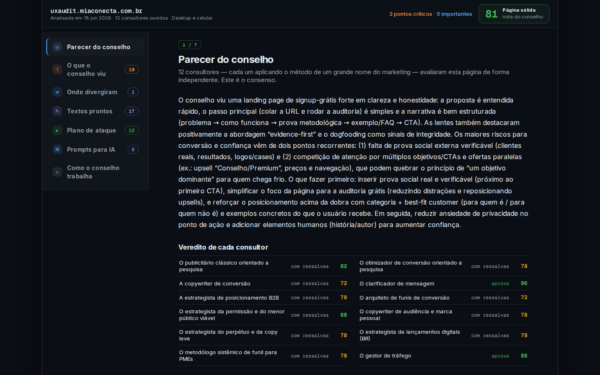

  

  <b>O checklist aberto de UX e conversão para páginas de venda e captação.</b>

  53 princípios com fundamentação real — Cialdini, Nielsen, Baymard, CXL. 
  O <i>companion</i> open-source do <a href="https://uxaudit.miaconecta.com.br">UX Audit</a>.

  <a href="README.md">English 🇺🇸</a> · <b>Português</b>

  <a href="CHECKLIST.pt-BR.md"><b>Checklist</b></a> ·
  <a href="catalog/README.pt-BR.md"><b>Catálogo</b></a> ·
  <a href="CONTRIBUTING.md"><b>Contribuir</b></a> ·
  <a href="https://uxaudit.miaconecta.com.br"><b>uxaudit.miaconecta.com.br ↗</b></a>

  
  
  
  

---

## O que é

Toda página de venda ou captação tropeça nos mesmos pontos: headline que não diz nada, botão escondido, prova social genérica, formulário que pede demais. Este é o catálogo aberto dos **53 princípios** que separam uma página que converte de uma que vaza visitante — cada um com o porquê, um checklist do que verificar e os erros mais comuns, ancorado em fontes reais (Cialdini, Nielsen Norman Group, Baymard, CXL).

É grátis, autocontido e feito pra ser útil sozinho. Sem encheção, sem "growth hack" — só os princípios, o raciocínio e como checar.

> **Você lê os princípios aqui; sua página é auditada lá.**
> O catálogo é genérico e aberto. O diagnóstico da **sua** página — com a evidência na própria tela, um score e um conselho de lentes de especialistas — é o que o [UX Audit](https://uxaudit.miaconecta.com.br) entrega.

## O que uma auditoria entrega

  

Exemplo real: a auditoria do próprio site deste projeto (dogfood).

Cada achado é ancorado em evidência visível na página (captura, DOM, copy), agrupado em **corrigir primeiro / melhorias opcionais / textos prontos / o que já está bem**, com um score 0–100 como sinal secundário. Sem evidência, sem achado.

## As 8 categorias

| # | Categoria | Princípios | O foco |
|:--:|---|:--:|---|
| 1 | **Clareza** | 6 | A página se explica em 5 segundos? |
| 2 | **Conversão** | 11 | O caminho até a ação é curto e óbvio? |
| 3 | **Hierarquia visual** | 8 | O olho é guiado até o que importa? |
| 4 | **Confiança** | 8 | Há razão para crer, com baixa percepção de risco? |
| 5 | **Persuasão** | 7 | A copy cria relevância e desejo? |
| 6 | **Conteúdo** | 7 | A mensagem fala a língua do cliente? |
| 7 | **Velocidade** | 2 | A página carrega antes de o visitante desistir? |
| 8 | **Acessibilidade** | 4 | Todos conseguem usar (WCAG)? |

→ **[Ver o catálogo completo dos 53 princípios](catalog/README.pt-BR.md)** · **[Checklist acionável](CHECKLIST.pt-BR.md)**

## Pra quem é

- **Criadores e indie hackers (global).** Você publica páginas rápido e quer um checklist confiável que cabe no seu fluxo — Markdown, GitHub, AI-friendly.
- **Gestores de tráfego e agências.** Você já procura "como melhorar página de venda". Quer a língua do negócio — leads, tráfego pago, conversão — e exemplos reais.

## Como usar

1. **Escolha uma categoria** que bate com a sua dúvida (clareza? confiança? conversão?).
2. **Rode o [checklist](CHECKLIST.pt-BR.md)** na sua página — cada item linka pro princípio com o porquê e os erros comuns.
3. **Quer feito pra você?** Audite a sua página de verdade e receba a evidência, o score e uma segunda opinião → **[uxaudit.miaconecta.com.br](https://uxaudit.miaconecta.com.br?utm_source=github&utm_medium=isca&utm_campaign=checklist)** (grátis: 2 auditorias, sem cartão).

## O Conselho

  

Além do checklist objetivo, o UX Audit traz uma **segunda opinião**: um conselho que analisa a página por várias lentes de especialistas em conversão, arbitra os trade-offs e devolve um parecer com veredito, hipótese e prioridade. É o julgamento que uma checagem automática, sozinha, não dá.

## Contribuir

Faltou um princípio? Tem uma página real (em qualquer idioma) que ilustra bem — ou viola — algum deles? PRs e issues são bem-vindos — veja o [CONTRIBUTING](CONTRIBUTING.md).

## Licença

Conteúdo sob **[CC BY-SA 4.0](LICENSE)** — use, adapte e compartilhe com atribuição; derivados permanecem abertos. Mantido por [UX Audit](https://uxaudit.miaconecta.com.br).

Se ajudou, uma ⭐ faz diferença.

